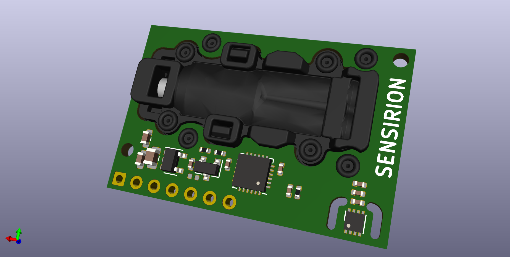

# SCD30 3d model

---

## What is it

A custom 3d model of the Sensirion. 

Sensirion provide a 3d model, but it's quite de-featured.

## Folder structure

```
kicad-src: KiCad v6 source files
production:
 - Gerbers:      [project]_gerbers.zip
 - Schematic:    [project].pdf
 - Board render: [project].png
```

## Render

