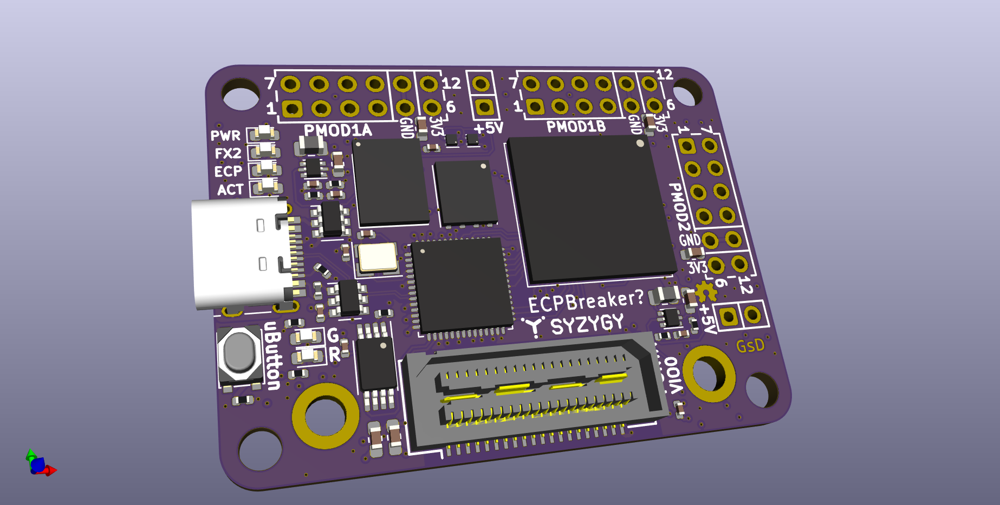
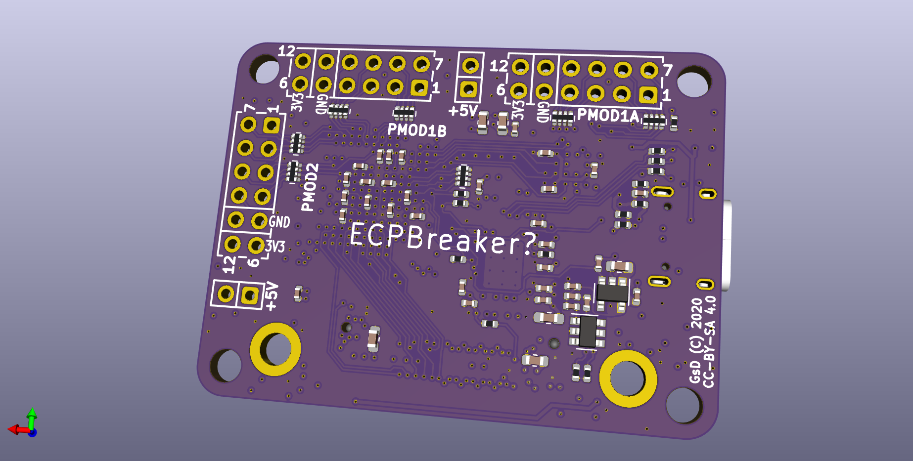

# ecpbreaker

The icebreaker is a friendly development board for the iCE40: [https://github.com/icebreaker-fpga/icebreaker](https://github.com/icebreaker-fpga/icebreaker)


---

## What is it

The icebreaker is a really nice and handy little board. But it has a small flaw, the ice40 FPGA it uses is quite smol, while it's often fun to see the exciting projects people pull off with 5k LUTs. Sometimes it's handy to have a bit of extra space available whe experimenting.

 - The board design takes the original designs and simply replaces the fpga with an ECP5.
 - FTDI replaced with a Cypress FX2 (Which uses an 8051 core)
 - Added SYZYGY port, with programmable VIO

Note this will not really work "out-of-the-box" like the icebreaker, the FX2 USB controller will require firmware to perform the JTAG programming. It is also likely responsible for the SYZYGY VIO configuration. 

## Folder structure

```
kicad-src: KiCad v6 source files
production:
 - Gerbers:      [project]_gerbers.zip
 - Schematic:    [project].pdf
 - Board render: [project].png
```

## Render



