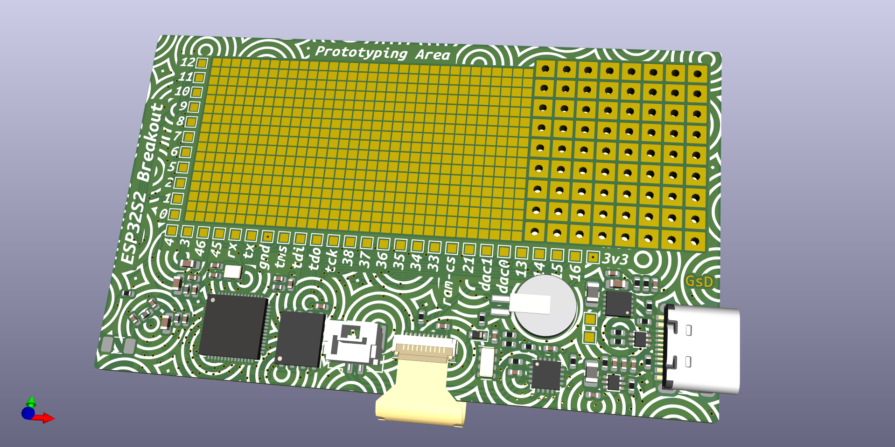
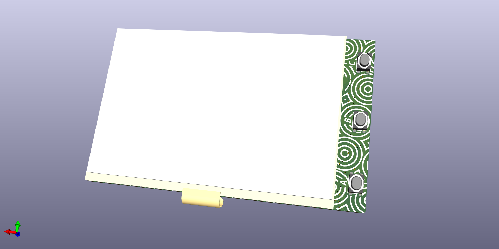

# ESP32s2 Breakout

---

## What is it

ESP32S2 + Sharp memory LCD + prototyping area

## Folder structure

```
kicad-src: KiCad v6 source files
production:
 - Gerbers:      [project]_gerbers.zip
 - Schematic:    [project].pdf
 - Board render: [project].png
```

## Render


