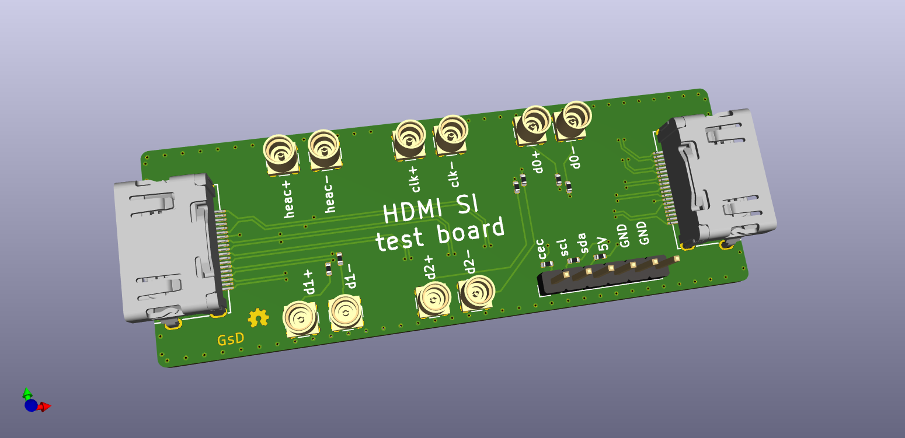

# HDMI-SI breakout

## What is it

A simple breakout of a HDMI cable signals for analysis/validation of signal levels, and phases.

## Folder structure

```
kicad-src: KiCad v6 source files
production:
 - Gerbers:      [project]_gerbers.zip
 - Schematic:    [project].pdf
 - Board render: [project].png
```

## Render

