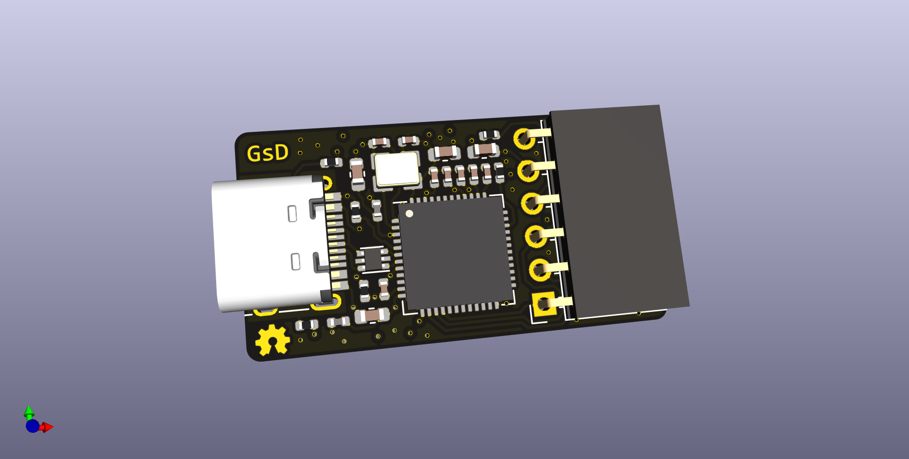

# FT232H based JTAG programmer

## What is it

Yet Another FT232H based JTAG programmer


## Folder structure

```
kicad-src: KiCad v6 source files
production:
 - Gerbers:      [project]_gerbers.zip
 - Schematic:    [project].pdf
 - Board render: [project].png
```

## Render

