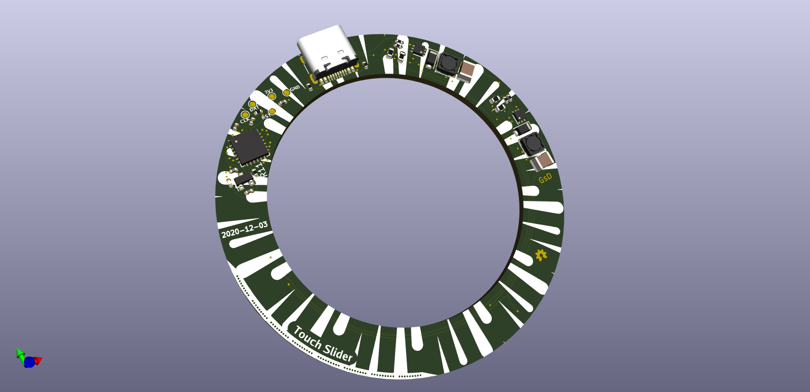

# Meiji Led Ring

This is a compact light source that will fit around the front of a Meiji microscope.

---

I was donated a reel of White LEDs, so I figure I should make use of them, I'm not sure if 24 LEDs will be enough. They are rated for 0.1W per device.

## What is it

This illuminator uses 24 While LEDs along with some high-frequency boost drivers, to avoid flickering whe filming. 

The device is powered from a USB-C port. 

A small ATSAML10 microcontroller is used to control the brightness from the LED drivers.
User control is from a sequence of touch-sensors along the edge of the PCB, demonstrated here in this [MSP430 project](https://www.youtube.com/watch?v=bC6S55T26lM).


## Folder structure

```
kicad-src: KiCad v6 source files
production:
 - Gerbers:      [project]_gerbers.zip
 - Schematic:    [project].pdf
 - Board render: [project].png
```

## Render

