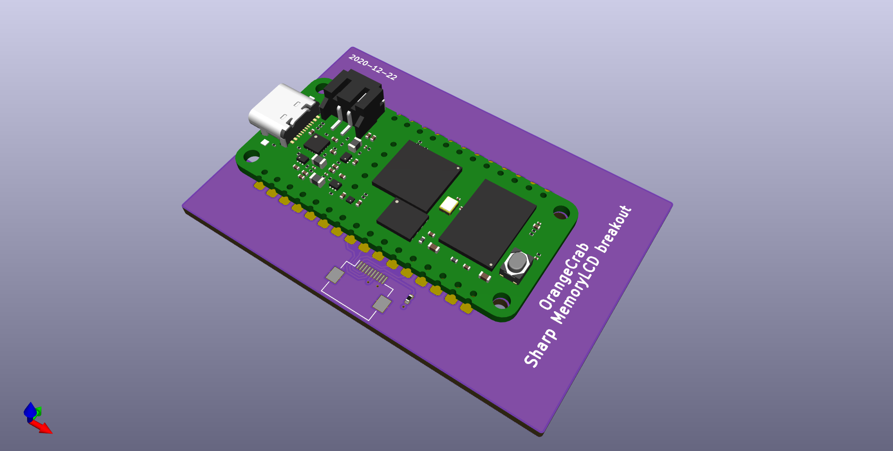

# Memory lcd wing

---

## What is it

A wing add-on that attaches to the OrangeCrab and adds a Sharp Memory LCD.

400x240 ON/OFF pixels.
The board is the size of the display.

## Folder structure

```
kicad-src: KiCad v6 source files
production:
 - Gerbers:      [project]_gerbers.zip
 - Schematic:    [project].pdf
 - Board render: [project].png
```

## Render

