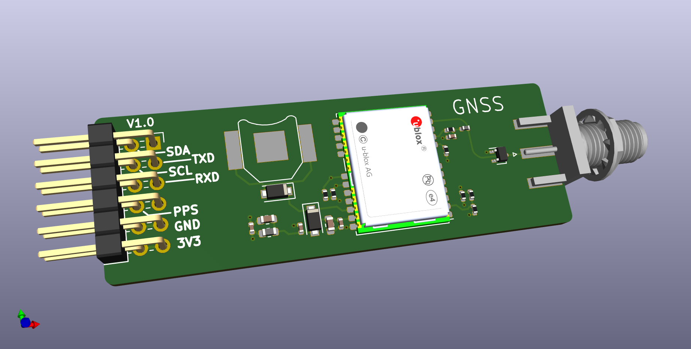

# PMOD GNSS


## What is it

A PMOD with a ublox NEO GNSS receiver footprint. Capable of recieving both GPS and GLONASS


## Folder structure

```
kicad-src: KiCad v6 source files
production:
 - Gerbers:      [project]_gerbers.zip
 - Schematic:    [project].pdf
 - Board render: [project].png
```

## Render

