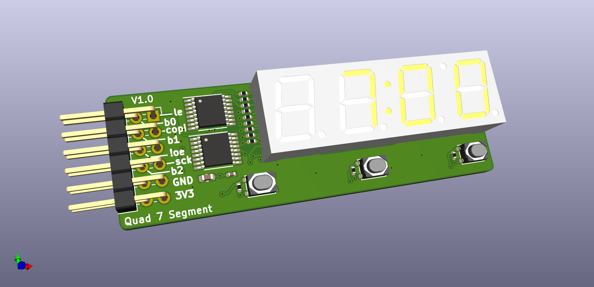

# PMOD Quad 7 Segment


## What is it

A PMOD with a quad 7-segment display connected to a pair of 74hc595 shift registers.

There are 3 tactile buttons.


## Folder structure

```
kicad-src: KiCad v6 source files
production:
 - Gerbers:      [project]_gerbers.zip
 - Schematic:    [project].pdf
 - Board render: [project].png
```

## Render

