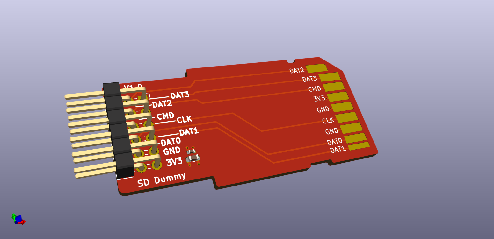

# PMOD SD Dummy


## What is it

A PMOD with a SD card footprint, for emulating an SD card to a host system.


## Folder structure

```
kicad-src: KiCad v6 source files
production:
 - Gerbers:      [project]_gerbers.zip
 - Schematic:    [project].pdf
 - Board render: [project].png
```

## Render

