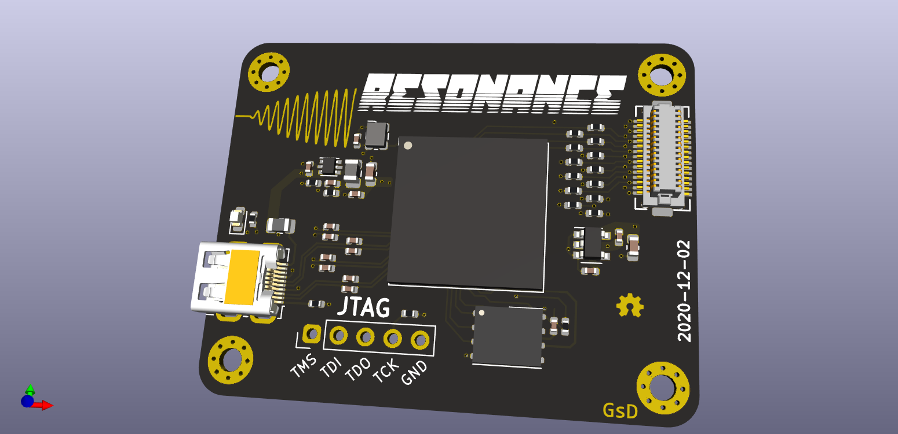

# Resonance

An add-on board for the [card10](https://card10.badge.events.ccc.de/)

---

## What is it

This board is intended to sit between the Fundamental and Harmonic board and monitor the SPI data running to the display. The ECP5 on-board will mirror the display and output a copy to a digital monitor.

## Folder structure

```
kicad-src: KiCad v6 source files
production:
 - Gerbers:      [project]_gerbers.zip
 - Schematic:    [project].pdf
 - Board render: [project].png
```

## Render

