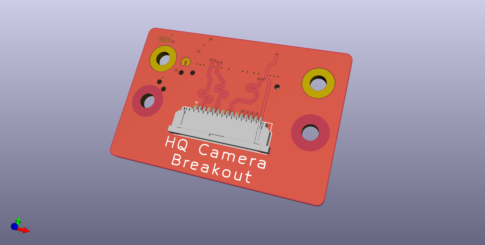

# SYZYGY breakout

SYZYGY is an FPGA expansion standard for medium to high speed interfaces. Learn more and check out the specifications here: [https://syzygyfpga.io/](https://syzygyfpga.io/)

---

## What is it

A very simple breakout connecting the CSI lanes to a SYZYGY connector via the Raspberry Pi's 15pin FFC.


## Folder structure

```
kicad-src: KiCad v6 source files
production:
 - Gerbers:      [project]_gerbers.zip
 - Schematic:    [project].pdf
 - Board render: [project].png
```

## Render

