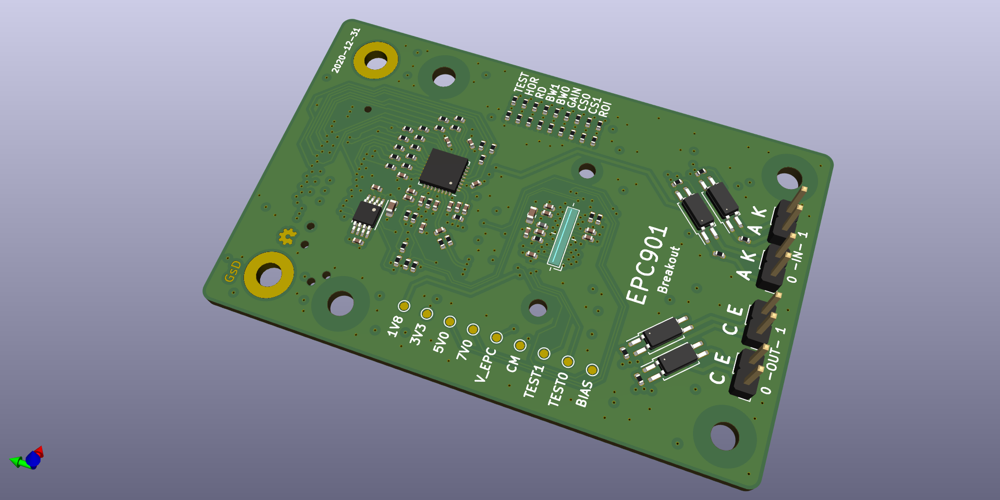

# SYZYGY EPC901 Breakout

SYZYGY is an FPGA expansion standard for medium to high speed interfaces. Learn more and check out the specifications here: [https://syzygyfpga.io/](https://syzygyfpga.io/)

Based on the breakout from astuder (https://github.com/astuder/epc901)

---

## What is it

The EPC901 is a 1024x1 CCD sensor, this sensor capable of 50MHz pixel output.
It outputs an analog voltage from the CCD elements. So I've paired it with a 50MSps ADC on a SYZYGY board. The datasheet claims it can run upto 50k fps.

External I/O are provided via opto-couplers to assist with connecting to an external trigger sources, for example a motion controller.
This board will assist with experiments on the new PnP platform. Where an object can move across the line scanner to capture a photo.

## Folder structure

```
kicad-src: KiCad v6 source files
production:
 - Gerbers:      [project]_gerbers.zip
 - Schematic:    [project].pdf
 - Board render: [project].png
```

## Render

