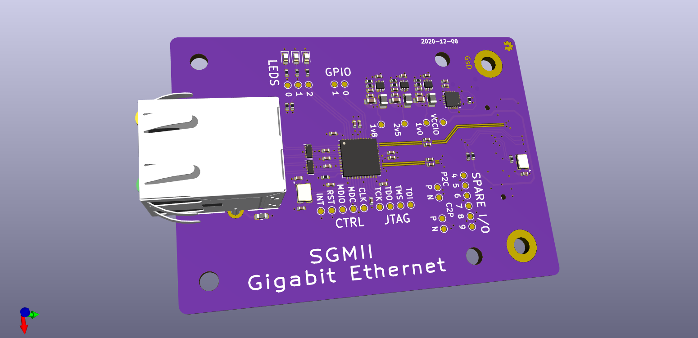

# SYZYGY-SGMII breakout

SYZYGY is an FPGA expansion standard for medium to high speed interfaces. Learn more and check out the specifications here: [https://syzygyfpga.io/](https://syzygyfpga.io/)

---

## What is it

A breakout for the DP83867C, a SGMII Gigabit Ethernet PHY.

This is connected to the SERDES via a SYZYGY-TXR connector, to test and evaluate ethernet over a 1.25Gbps serial lane. 2 lanes are used, and CDR will need to be used on the RX path.

SGMII significantly reduces the number of signals required to route when compared to RGMII.


## Folder structure

```
kicad-src: KiCad v6 source files
production:
 - Gerbers:      [project]_gerbers.zip
 - Schematic:    [project].pdf
 - Board render: [project].png
```

## Render

